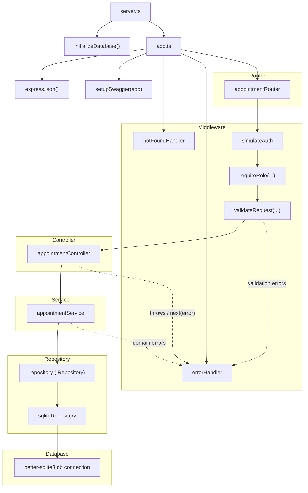

# Clinic Appointment API

Simple clinic appointment booking API built with Node.js, Express, TypeScript, SQLite, and Zod.

## Features

- Create appointments
- List appointments for one clinician
- List all appointments as an admin
- Request validation with Zod
- Swagger/OpenAPI docs
- SQLite-backed persistence
- Concurrency-safe appointment creation

## Requirements

- Docker and Docker Compose
- Node.js 24+ and npm, if you want to run the app locally without Docker

## Docker

Build and start the API with Docker Compose:

```bash
docker compose up --build
```

This exposes the API at `http://localhost:3000` and persists the SQLite database under `./data`.

To stop the container:

```bash
docker compose down
```

The server listens on `http://localhost:3000`.

## Local Development

If you want to run the app without Docker:

```bash
npm install
npm run dev
```

## API Overview

The app exposes:

- `POST /appointments`
- `GET /clinicians/:id/appointments`
- `GET /appointments` for admin users
- Swagger UI at `/api-docs`
- OpenAPI JSON at `/openapi.json`

Authentication is simulated with the `x-user-role` header. Valid values are:

- `patient`
- `clinician`
- `admin`

## Example Requests

### Create an appointment

```bash
curl -X POST http://localhost:3000/appointments \
  -H "Content-Type: application/json" \
  -H "x-user-role: admin" \
  -d '{
    "clinicianId": 1,
    "patientId": 1,
    "start": "2099-06-10T09:00:00+10:00",
    "end": "2099-06-10T09:30:00+10:00"
  }'
```

Expected response: `201 Created` with the created appointment in JSON.

### List appointments for one clinician

```bash
curl "http://localhost:3000/clinicians/1/appointments?from=2099-06-10T08:00:00%2B10:00&to=2099-06-10T10:00:00%2B10:00" \
  -H "x-user-role: admin"
```

### List all appointments as admin

```bash
curl "http://localhost:3000/appointments?limit=10" \
  -H "x-user-role: admin"
```

## Project Structure

The request flow is:

1. `server.ts` initializes the database and starts the HTTP server.
2. `app.ts` configures Express middleware, Swagger, routes, and global error handling.
3. `appointmentRoutes.ts` matches the route and runs auth and request validation middleware.
4. `appointmentController.ts` reads validated data from `res.locals` and delegates to the service layer.
5. `appointmentService.ts` applies business rules and transforms request datetimes to UTC ISO strings.
6. `sqliteRepository.ts` runs SQLite queries and transactions through the shared `db` connection.



Notes:

- `app.ts` does not call the controller directly. The request goes through route-level middleware first.
- `appointmentService.ts` talks to the repository abstraction, and the current implementation behind it is `sqliteRepository`.
- `errorHandler` is the final step for validation, authorization, not-found, and application errors.

## Design Decisions / Tradeoffs

### Concurrency safety

Appointment creation wraps the overlap check and insert in a SQLite immediate transaction. That means two overlapping requests cannot both pass validation before either one is committed.

This keeps the implementation simple and reliable for SQLite without requiring database-specific exclusion constraints.

### Simulated role-based access

Instead of a full authentication system, the project uses the `x-user-role` header to simulate patient, clinician, and admin access. This keeps the API easy to test and reason about while still exercising authorization behavior.

### Validation at the edge

Zod schemas validate request bodies, params, and query strings before handlers run. This reduces controller complexity and makes invalid input fail early with clear errors.

### SQLite as the storage layer

SQLite is a practical choice for a small appointment service and makes local development, tests, and Docker usage straightforward. The tradeoff is that it is simpler than a larger production database setup, but it is a good fit for this project's scope.

## Concurrency and Race Condition Handling

Appointment creation is concurrency-safe by wrapping the overlap check and insert in a SQLite immediate transaction.

This ensures the availability check and appointment creation happen atomically, preventing concurrent requests from both passing the overlap check before either appointment is committed.

Example:

1. Request A starts an immediate transaction and acquires the write lock.
2. Request B attempts to create an overlapping appointment and must wait.
3. Request A checks for overlaps and inserts the appointment.
4. Request A commits the transaction.
5. Request B continues, performs the overlap check again, detects the newly created appointment, and fails with a conflict error.

As a result, overlapping appointments cannot be created even when multiple requests are submitted concurrently.

This approach provides application-level concurrency protection without requiring database-specific exclusion constraints, while remaining simple and reliable for a SQLite-based solution.

## Test

Run the test suite:

```bash
npm run test:run
```

Run tests in watch mode:

```bash
npm test
```

Run tests with coverage:

```bash
npm run test:coverage
```

Run formatting checks:

```bash
npm run format:check
```

Format the codebase:

```bash
npm run format
```

## Test Coverage

The test suite is organized by file so each layer can be verified independently.

### `test/integration/appointmentsApi.test.ts`

- `POST /appointments`
- `creates an appointment`
- `returns 400 for invalid datetime`
- `returns 400 when start is after end`
- `returns 404 when clinician does not exist`
- `returns 404 when patient does not exist`
- `returns 409 when same clinician has overlapping appointment`
- `returns 409 when same patient has overlapping appointment with different clinician`
- `allows appointments that touch but do not overlap`
- `allows only one appointment when two overlapping requests are submitted concurrently`
- `GET /clinicians/:id/appointments`
- `lists appointments for one clinician`
- `supports from and to query params`
- `returns 400 for invalid clinician id`
- `returns 400 for invalid date range`
- `returns 404 when clinician does not exist`
- `GET /appointments`
- `lists all upcoming appointments for admin`
- `supports limit`
- `supports from and to query params`
- `returns 403 when non-admin tries to list all appointments`
- `returns 401 when role header is missing`
- `returns 400 for invalid limit`
- `not found`
- `returns 404 for unknown route`

### `test/controllers/appointmentController.test.ts`

- `createAppointmentHandler`
- `returns 201 with created appointment`
- `passes errors to next`
- `listClinicianAppointmentsHandler`
- `returns 200 with clinician appointments`
- `passes errors to next`
- `listAllAppointmentsHandler`
- `returns 200 with all appointments`
- `passes errors to next`

### `test/db/sqliteRepository.test.ts`

- `clinicianExists`
- `returns true when clinician exists`
- `returns false when clinician does not exist`
- `patientExists`
- `returns true when patient exists`
- `returns false when patient does not exist`
- `createAppointmentSafely`
- `creates appointment when there is no overlap`
- `throws AppointmentOverlapError when appointment overlaps`
- `findAppointmentsByClinician`
- `returns only matching clinician appointments within the range`
- `findAppointments`
- `returns appointments sorted by start time and respects limit`

### `test/middleware/auth.test.ts`

- `simulateAuth`
- `sets user role and calls next when role is valid`
- `throws UnAuthenticatedError when role header is missing`
- `throws UnAuthenticatedError when role is invalid`
- `requireRole`
- `calls next when user role is allowed`
- `calls next when user role is one of allowed roles`
- `throws UnAuthenticatedError when user is missing`
- `throws ForbiddenError when user role is not allowed`

### `test/middleware/errorHandler.test.ts`

- `returns AppError status code and message`
- `returns 500 for unknown errors`
- `includes details when AppError provides them`
- `omits empty error groups from validation details`
- `notFoundHandler`
- `returns 404 with route information`

### `test/validation/appointmentSchema.test.ts`

- `createAppointmentSchema`
- `accepts a valid appointment request`
- `rejects invalid start datetime`
- `rejects invalid end datetime`
- `rejects when start is equal to end`
- `rejects when start is after end`
- `rejects when start is in the past`
- `rejects non-integer clinicianId`
- `rejects non-positive patientId`
- `clinicianAppointmentsParamsSchema`
- `coerces id from string to number`
- `rejects invalid id`
- `rejects non-positive id`
- `appointmentQuerySchema`
- `accepts empty query`
- `accepts only from`
- `accepts only to`
- `rejects invalid from`
- `rejects when from is after to`
- `adminAppointmentsQuerySchema`
- `accepts empty query`
- `coerces limit from string to number`
- `rejects invalid limit`
- `rejects zero limit`
- `rejects limit greater than 100`
- `rejects when from is after to`
- `does not add date range error when from is invalid`

## Test Database Isolation

Tests use a separate SQLite file so they do not write into the normal development database.

- In [database.ts](C:\Users\tongw\Documents\Code\ClinicAppointment\src\db\database.ts), the database path switches based on environment:
  - `data/test-clinic.db` when `NODE_ENV === "test"`
  - `data/clinic.db` otherwise
- The CI workflow sets `NODE_ENV=test`, so GitHub Actions also uses the test database.
- In [setupTestDb.ts](C:\Users\tongw\Documents\Code\ClinicAppointment\test\setupTestDb.ts), `startTestDatabase()` initializes the schema and seed data before tests run.
- `resetTestDatabase()` clears only the `appointments` table before each test so each case starts from a clean booking state.
- `closeTestDatabase()` removes test data, resets SQLite sequences, and closes the shared connection after the suite finishes.

This keeps the tests deterministic while protecting local development data from accidental modification.

## Swagger Docs

After starting the app, open:

- `http://localhost:3000/api-docs`
- `http://localhost:3000/openapi.json`
